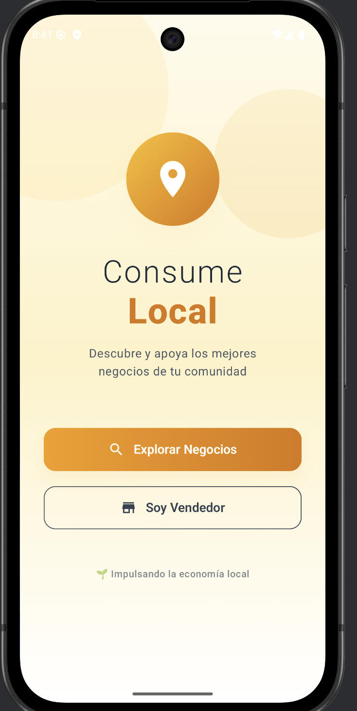
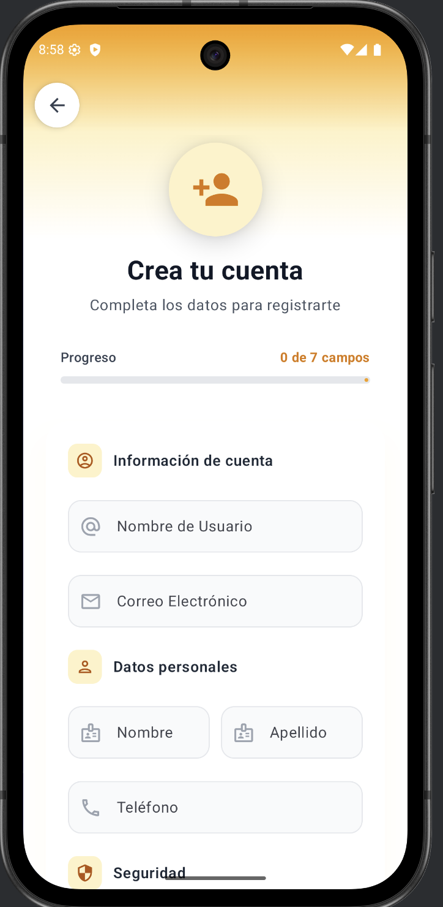
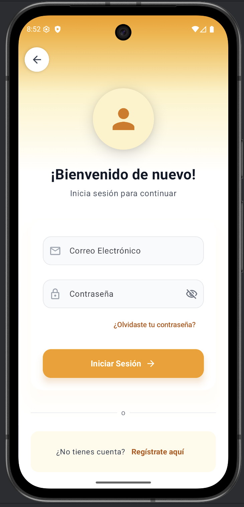
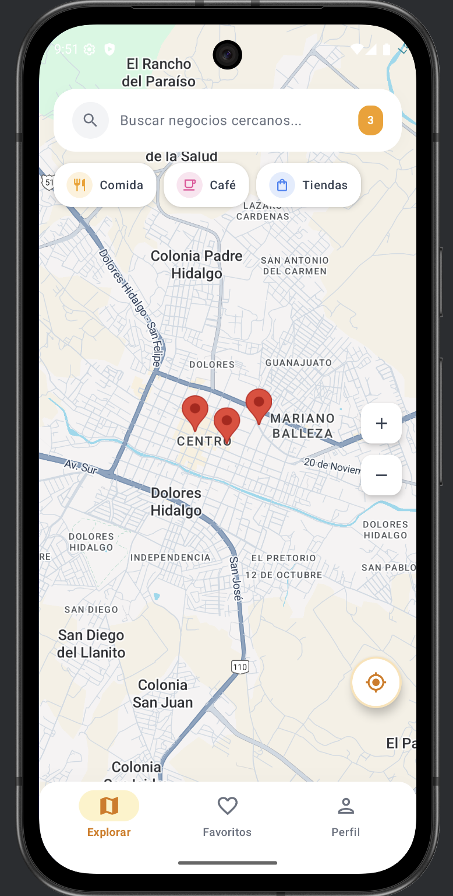
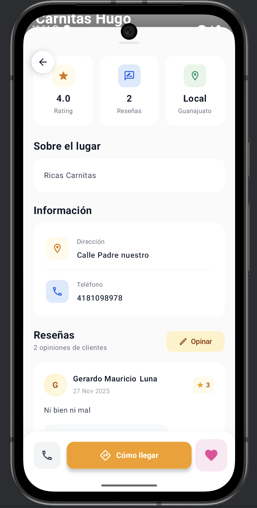

<div align="center">

# 🍔 FoodMarket


**Aplicación móvil Android para promover el consumo de productos y servicios locales**

[Características](#-características) •
[Capturas de Pantalla](#-capturas-de-pantalla) •
[Tecnologías](#-tecnologías) •
[Instalación](#-instalación) •
[Estructura](#-estructura-del-proyecto)
</div>

---

## 📋 Tabla de Contenidos

- [Descripción del Proyecto](#-descripción-del-proyecto)
- [Características](#-características)
- [Capturas de Pantalla](#-capturas-de-pantalla)
- [Tecnologías](#-tecnologías)
- [Instalación](#-instalación)
- [Configuración de Firebase](#-configuración-de-firebase)
- [Estructura del Proyecto](#-estructura-del-proyecto)
- [Ejemplos de Código](#-ejemplos-de-código)
- [Guía de Testing](#-guía-de-testing)
- [Contribución](#-contribución)
- [Contacto](#-contacto)

---

## 📖 Descripción del Proyecto

**FoodMarket** es una aplicación móvil desarrollada en Kotlin con Jetpack Compose que permite a los usuarios explorar y descubrir mercados de comida, restaurantes y establecimientos gastronómicos locales. La aplicación conecta a los amantes de la comida con los mejores lugares para disfrutar de experiencias culinarias únicas en su comunidad.

La plataforma ofrece una experiencia de usuario moderna e intuitiva, implementando las últimas tecnologías de desarrollo Android. Cuenta con un sistema de autenticación seguro mediante Firebase, integración con Google Maps para localización de establecimientos, y una arquitectura robusta basada en MVVM con Hilt para inyección de dependencias. 

Además, la aplicación está diseñada siguiendo los principios de Material Design 3 y Clean Architecture, garantizando un código limpio, mantenible y escalable.  El proyecto busca facilitar el descubrimiento de opciones gastronómicas locales, promoviendo el comercio de proximidad y fortaleciendo la economía local.

---

## ✨ Características

| Característica | Descripción |
|----------------|-------------|
| 🔐 **Autenticación Segura** | Sistema completo de registro e inicio de sesión con Firebase Authentication |
| 🗺️ **Mapas Interactivos** | Explora establecimientos cercanos con Google Maps integrado |
| 📍 **Geolocalización** | Encuentra mercados y restaurantes cerca de tu ubicación actual |
| 🎨 **Interfaz Moderna** | UI/UX desarrollada con Jetpack Compose y Material Design 3 |
| 📱 **Diseño Responsivo** | Adaptación perfecta a diferentes tamaños de pantalla |
| 🔄 **Sincronización en Tiempo Real** | Datos actualizados instantáneamente con Firebase Firestore |
| 🌙 **Modo Oscuro** | Soporte para tema claro y oscuro |
| 🔍 **Búsqueda Avanzada** | Encuentra productos y establecimientos específicos fácilmente |

---

## 📸 Capturas de Pantalla

<div align="center">

### Pantallas Principales

| Pantalla de Inicio | Registro | Inicio de Sesión |
|:------------------:|:--------:|:----------------:|
|  |  |  |

### Funcionalidades

| Explorar Mercados | Detalle de Establecimiento | Perfil de Usuario |
|:-----------------:|:--------------------------:|:-----------------:|
|  |  |  |

</div>

> 📝 **Nota:** Agrega tus capturas de pantalla en la carpeta `docs/screenshots/`

---

## 🛠️ Tecnologías

<div align="center">

| Tecnología | Versión | Descripción |
|------------|---------|-------------|
| **Kotlin** | 1. 9.x | Lenguaje de programación principal |
| **Jetpack Compose** | Latest | Framework de UI declarativa |
| **Firebase Auth** | BOM 33.7.0 | Autenticación de usuarios |
| **Firebase Firestore** | BOM 33. 7.0 | Base de datos en tiempo real |
| **Material Design 3** | Latest | Sistema de diseño |
| **Android SDK** | 36 | Kit de desarrollo Android |
| **Hilt** | 2. 50 | Inyección de dependencias |
| **Google Maps Compose** | 6.1.0 | Mapas interactivos |
| **Coil** | 2.5.0 | Carga de imágenes |
| **Navigation Compose** | 2.7.7 | Navegación entre pantallas |
| **Gradle (Kotlin DSL)** | 8. x | Sistema de compilación |

</div>

### Arquitectura
- **Patrón MVVM** (Model-View-ViewModel)
- **Clean Architecture**
- **Hilt Dependency Injection**
- **Jetpack Navigation Compose**

---

## 📥 Instalación

### Prerrequisitos

- Android Studio Hedgehog (2023.1.1) o superior
- JDK 17 o superior
- SDK de Android 36
- Cuenta de Firebase

### Pasos de Instalación

1. **Clonar el repositorio**
   ```bash
   git clone https://github.com/DevLunaX/FoodMarket. git
   cd FoodMarket
   ```

2.  **Abrir en Android Studio**
   ```
   File -> Open -> Seleccionar la carpeta del proyecto
   ```

3.  **Configurar Firebase** (ver sección siguiente)

4. **Sincronizar Gradle**
   ```bash
   ./gradlew build
   ```

5. **Ejecutar la aplicación**
   ```bash
   ./gradlew installDebug
   ```
   O presiona el botón ▶️ Run en Android Studio

---

## 🔥 Configuración de Firebase

1.  Accede a [Firebase Console](https://console.firebase.google.com/)

2. Crea un nuevo proyecto o selecciona uno existente

3. Agrega una aplicación Android con el paquete:
   ```
   mx.edu.utng.foodmarket
   ```

4.  Descarga el archivo `google-services.json`

5. Coloca el archivo en la carpeta `app/`:
   ```
   app/google-services.json
   ```

6.  Configura las APIs necesarias:
   - ✅ Authentication (Email/Password)
   - ✅ Cloud Firestore
   - ✅ Storage (opcional)

7. Crea el archivo `secrets.properties` en la raíz del proyecto con tus claves:
   ```properties
   MAPS_API_KEY=tu_api_key_aqui
   ```

---

## 📁 Estructura del Proyecto

```plaintext
FoodMarket/
├── 📁 app/
│   ├── 📁 src/
│   │   ├── 📁 main/
│   │   │   ├── 📁 java/mx/edu/utng/foodmarket/
│   │   │   │   ├── 📄 MainActivity.kt          # Actividad principal
│   │   │   │   ├── 📁 data/                    # Capa de datos
│   │   │   │   │   ├── 📁 model/               # Modelos de datos
│   │   │   │   │   └── 📁 repository/          # Repositorios
│   │   │   │   ├── 📁 di/                      # Módulos de Hilt (Inyección de dependencias)
│   │   │   │   └── 📁 ui/                      # Capa de presentación
│   │   │   │       ├── 📁 components/          # Componentes reutilizables UI
│   │   │   │       ├── 📁 features/            # Pantallas/Features de la app
│   │   │   │       └── 📁 theme/               # Configuración de Material Theme
│   │   │   ├── 📁 res/                         # Recursos (drawable, values, etc.)
│   │   │   └── 📄 AndroidManifest.xml          # Manifiesto de la aplicación
│   │   └── 📁 test/                            # Tests unitarios
│   ├── 📄 build.gradle. kts                     # Configuración de Gradle (módulo)
│   ├── 📄 google-services.json                 # Configuración de Firebase
│   └── 📄 proguard-rules. pro                   # Reglas de ProGuard
├── 📁 docs/
│   └── 📁 screenshots/                         # Capturas de pantalla
├── 📁 gradle/                                  # Wrapper de Gradle
├── 📄 build.gradle.kts                         # Configuración de Gradle (proyecto)
├── 📄 settings.gradle.kts                      # Configuración de módulos
├── 📄 secrets.properties                       # API Keys (no subir a git)
├── 📄 gradle.properties                        # Propiedades de Gradle
├── 📄 . gitignore                               # Archivos ignorados por Git
└── 📄 README.md                                # Este archivo
```

---

## 💻 Ejemplos de Código

### Configuración de Hilt - Application

```kotlin
/**
 * FoodMarketApplication - Clase Application con Hilt
 * 
 * Punto de entrada de la aplicación que inicializa
 * el framework de inyección de dependencias Hilt. 
 *
 * @author DevLunaX
 * @since 1.0.0
 */
@HiltAndroidApp
class FoodMarketApplication : Application()
```

### ViewModel con Hilt

```kotlin
/**
 * MarketViewModel - ViewModel para gestión de mercados
 *
 * Maneja la lógica de negocio relacionada con la
 * obtención y manipulación de datos de mercados de comida.
 *
 * @property marketRepository Repositorio de mercados inyectado por Hilt
 * @author DevLunaX
 * @since 1.0. 0
 */
@HiltViewModel
class MarketViewModel @Inject constructor(
    private val marketRepository: MarketRepository
) : ViewModel() {
    
    private val _markets = MutableStateFlow<List<Market>>(emptyList())
    val markets: StateFlow<List<Market>> = _markets.asStateFlow()
    
    private val _isLoading = MutableStateFlow(false)
    val isLoading: StateFlow<Boolean> = _isLoading.asStateFlow()
    
    /**
     * Carga la lista de mercados desde Firestore. 
     *
     * Ejemplo de uso:
     * ```kotlin
     * viewModel.loadMarkets()
     * ```
     */
    fun loadMarkets() {
        viewModelScope.launch {
            _isLoading.value = true
            marketRepository.getMarkets()
                .onSuccess { _markets.value = it }
                .onFailure { /* Manejar error */ }
            _isLoading.value = false
        }
    }
}
```

### Componente de UI con Jetpack Compose

```kotlin
/**
 * MarketCard - Tarjeta de mercado reutilizable
 *
 * Componente de tarjeta estilizado siguiendo Material Design 3
 * para mostrar información de establecimientos gastronómicos. 
 *
 * @param market Datos del mercado a mostrar
 * @param onClick Callback ejecutado al presionar la tarjeta
 * @param modifier Modificadores opcionales de Compose
 *
 * Ejemplo de uso:
 * ```kotlin
 * MarketCard(
 *     market = market,
 *     onClick = { navController.navigate("detail/${market.id}") }
 * )
 * ```
 */
@Composable
fun MarketCard(
    market: Market,
    onClick: () -> Unit,
    modifier: Modifier = Modifier
) {
    Card(
        onClick = onClick,
        modifier = modifier
            .fillMaxWidth()
            .padding(8.dp),
        shape = RoundedCornerShape(16.dp),
        colors = CardDefaults. cardColors(
            containerColor = MaterialTheme.colorScheme.surface
        ),
        elevation = CardDefaults. cardElevation(defaultElevation = 4.dp)
    ) {
        Column(modifier = Modifier.padding(16.dp)) {
            AsyncImage(
                model = market.imageUrl,
                contentDescription = market.name,
                modifier = Modifier
                    .fillMaxWidth()
                    .height(150.dp)
                    .clip(RoundedCornerShape(12.dp)),
                contentScale = ContentScale. Crop
            )
            
            Spacer(modifier = Modifier.height(12.dp))
            
            Text(
                text = market. name,
                style = MaterialTheme. typography.titleMedium,
                fontWeight = FontWeight. Bold
            )
            
            Text(
                text = market.address,
                style = MaterialTheme.typography.bodyMedium,
                color = MaterialTheme. colorScheme.onSurfaceVariant
            )
        }
    }
}
```

---

## 🧪 Guía de Testing

### Ejecutar Tests Unitarios

```bash
./gradlew test
```

### Ejecutar Tests de Instrumentación

```bash
./gradlew connectedAndroidTest
```

### Generar Reporte de Cobertura

```bash
./gradlew jacocoTestReport
```

---

## 🤝 Contribución

¡Las contribuciones son bienvenidas! Sigue estos pasos:

1. **Fork** el repositorio
2. **Crea** una rama para tu feature
   ```bash
   git checkout -b feature/NuevaCaracteristica
   ```
3. **Commit** tus cambios
   ```bash
   git commit -m 'Add: Nueva característica increíble'
   ```
4. **Push** a la rama
   ```bash
   git push origin feature/NuevaCaracteristica
   ```
5.  **Abre** un Pull Request

### Convención de Commits

| Prefijo | Descripción |
|---------|-------------|
| `Add:` | Nueva funcionalidad |
| `Fix:` | Corrección de bugs |
| `Update:` | Actualización de código existente |
| `Docs:` | Cambios en documentación |
| `Style:` | Cambios de formato/estilo |
| `Refactor:` | Refactorización de código |

---

## 📞 Contacto

<div align="center">

**DevLunaX**

[](https://github.com/DevLunaX)
[](mailto:tu-email@ejemplo. com)
[](https://www.linkedin.com/in/tu-perfil/)

</div>

---

<div align="center">

**⭐ Si este proyecto te fue útil, no olvides darle una estrella ⭐**

*Hecho con ❤️ para los amantes de la gastronomía local*

*Última actualización: Diciembre 2025*

</div>
